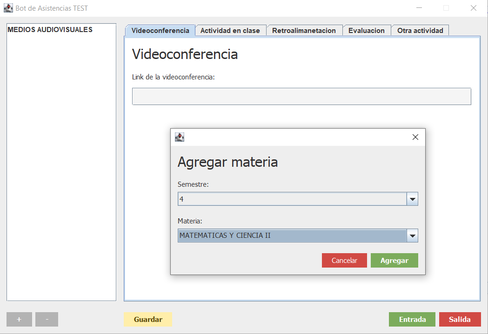

# Asistencias CUESHP Bot
Esta aplicaion permitirá llenar los formularios de 
asistencia de cada sesion de manera automatica.

# Indice
* [Requerimientos](#requerimientos)
* [Interfaz Grafica](#nterfaz-grafica)
* [Instrucciones de uso](#instrucciones-de-uso)
    * [Agregar una materia](#agregar-una-materia)
    * [Eliminar una materia](#eliminar-una-materia)
    * [Guardar los datos de una materia](#guardar-los-datos-de-una-materia)
    * [Como hacer el registro de una entrada](#como-hacer-el-registro-de-una-entrada)
    * [Como hacer el registro de una salida](#Como-hacer-el-registro-de-una-salida)
* [Problemas](#problemas)

# Requerimientos
* Wondows 7/10
* Java 11

# Interfaz Grafica

# Instrucciones de uso
## Agregar una materia
## Eliminar una materia
## Guardar los datos de una materia
## Como hacer el registro de una entrada
## Como hacer el registro de una salida

# Problemas
|Problema|Algunas posibles soluciones|Solucion temporal|
|-|-|-|
|La funcion getElementById no funciona, debido a que no se ha especificado un esquema el cual indique que atributo es de tipo ID|<ul><li>[Java XML DOM: how are id Attributes special?](https://stackoverflow.com/questions/3423430/java-xml-dom-how-are-id-attributes-special)</li><li>[Java: How to make getElementById() work using xml schema](http://crumpling-rumblings.blogspot.com/2008/05/java-how-to-make-getelementbyid-work.html)</li><li>[Esquemas XML](http://elvex.ugr.es/decsai/csharp/xml/xml-schema.xml)</li><li>[Busqueda de soluciones en Google](https://www.google.com/search?client=firefox-b-d&q=getelementbyid+not+working+java)</li></ul>|Se busca un atributo _'id'_ en cada tag del XML y se compara con el _'id'_ que se desea encontrar, si se encuentra entonces se debuelve el nodo que posee el _'id'_. Con esto se hace una simulacion del metodo getElementById|